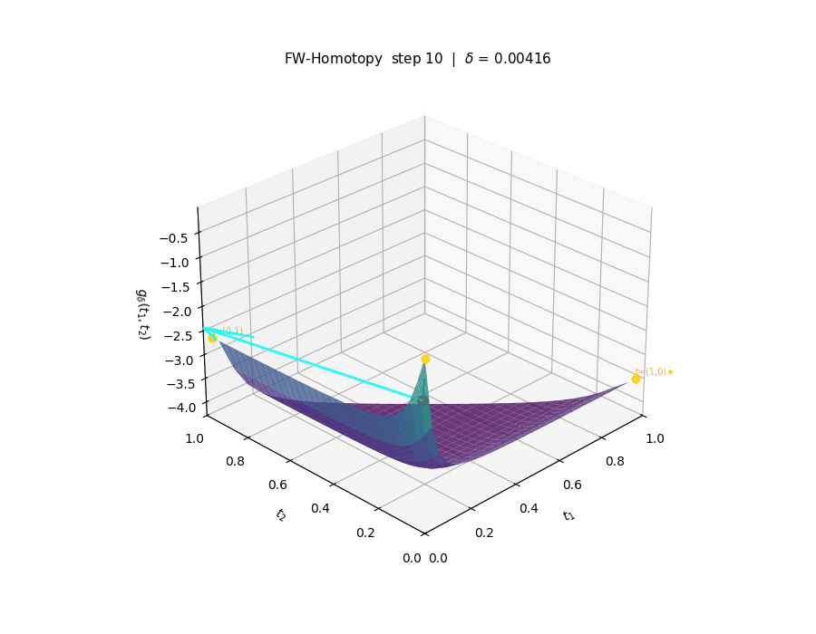
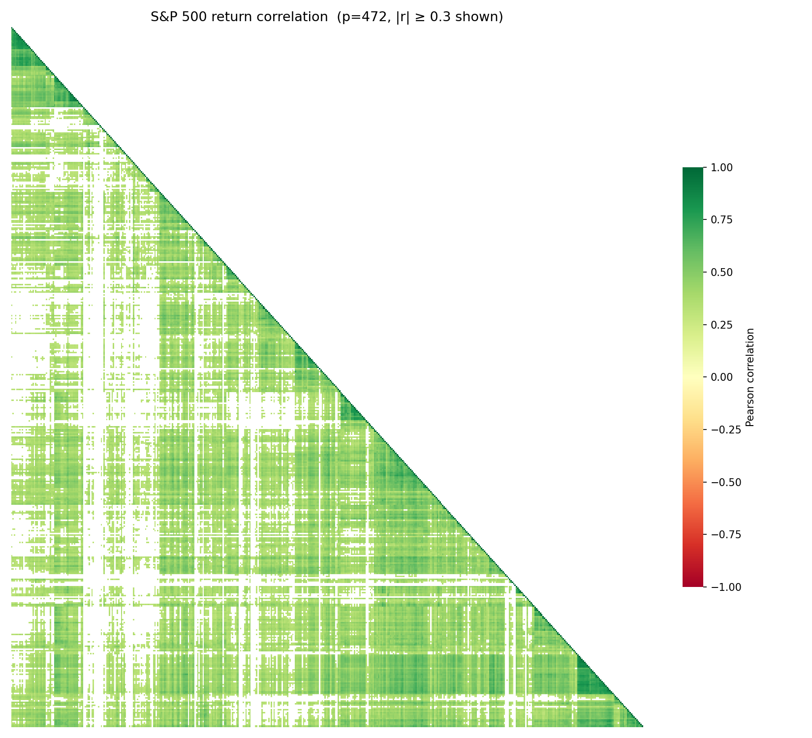
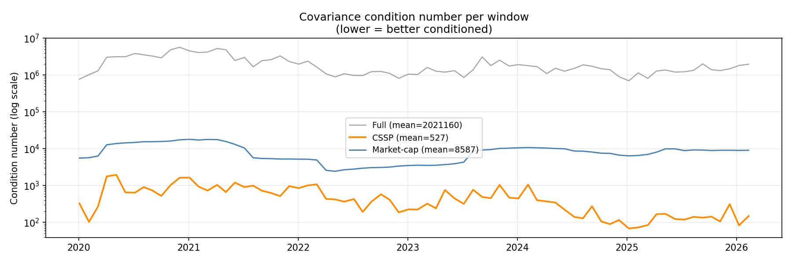
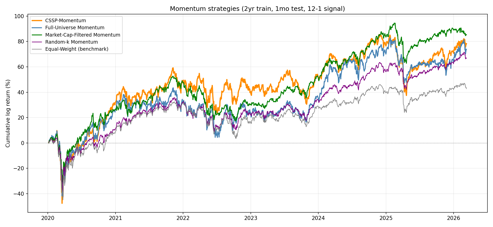
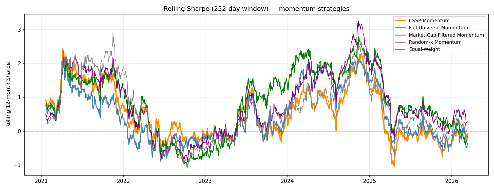
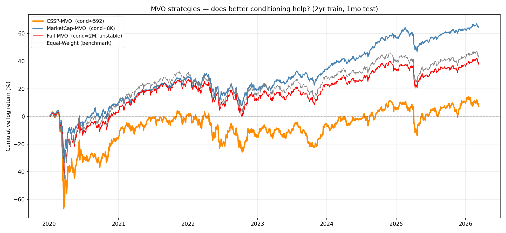
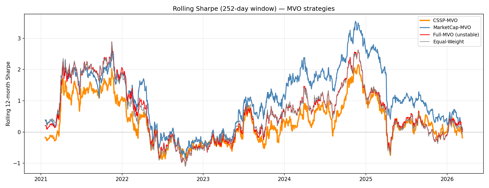

# GridFW: Scalable Column Subset Selection via Boolean Relaxation and Frank-Wolfe

Python implementation of [_Scalable Column Subset Selection via Boolean Relaxation and Frank-Wolfe Method_](CSSP.pdf) (KIM, 2026).

## What it does

The **Column Subset Selection Problem (CSSP)** asks: given a data matrix $X \in \mathbb{R}^{n \times p}$, find the $k$ columns that best reconstruct the full matrix under the projection objective:

$$
\max_{s \in \{0,1\}^p,\, |s| \leq k} \text{Tr}(X^T P_S X)
$$

This is NP-hard. Standard approaches are exact-but-exponential (branch-and-bound) or fast-but-suboptimal (greedy forward selection). This library takes a third path.

**Financial interpretation:** selecting the $k$ assets whose joint covariance structure best spans the full index — the core problem in sparse ETF replication and index tracking.

## Key idea

We adapt the **Boolean relaxation** framework of Moka et al. (2025) — originally developed for minimum-variance portfolio selection — and show it applies directly to CSSP. The key observation is that the CSSP inner subproblem has the same algebraic form as a minimum-variance portfolio problem, giving a continuous relaxation with provable properties.

The relaxed objective $g_\delta(t)$ over $t \in [0,1]^p$ is:

- **Strictly convex** when $\delta \geq \eta_1$ (largest eigenvalue of $A = X^T X / n$)
- **Agrees with the original** at every binary corner $s \in \{0,1\}^p$

**FW-Homotopy** exploits this with a geometric schedule $\delta_0 \to \eta_1$: start in the convex regime (unique minimum), gradually transition to the non-convex regime while tracking the solution. Gradients are estimated via Monte Carlo Rademacher sampling; the Frank-Wolfe LMO selects the $k$ columns with smallest gradient components.

### Demo



As $\delta$ increases, the surface transitions from convex to concave and the iterate converges to a binary corner.

## Algorithm benchmarks

Benchmarked on 8 datasets ($p = 103$ to $639$) against greedy forward selection:

| Regime               | Objective vs Greedy | Speedup           |
| -------------------- | ------------------- | ----------------- |
| Dense ($k/p > 0.2$)  | Within 3%           | Up to 3.5× faster |
| Sparse ($k/p < 0.1$) | Higher variance     | Greedy preferred  |

**Recommended parameters:** $\alpha \in [0.1, 0.2]$, $m \in [50, 200]$. Steps $n$ and step-size $\alpha$ dominate quality; more MC samples give diminishing returns.

## Installation

```bash
pip install git+https://github.com/SnowHana/gridfw.git
```

Or in editable mode:

```bash
git clone https://github.com/SnowHana/gridfw.git
cd gridfw
pip install -e .
```

## Usage

```python
import numpy as np
from grad_fw import FWHomotopySolver

# Build covariance matrix from return data
X = np.random.randn(252, 100)   # 252 trading days, 100 assets
A = X.T @ X / len(X)

# Select k=20 assets that best span the covariance structure
solver = FWHomotopySolver(A, k=20, alpha=0.1, n_steps=500, n_mc_samples=50)
s = solver.solve()
selected = np.where(s > 0.5)[0]

print(f"Selected assets: {selected}")  # exactly 20 indices
```

For comparison against the greedy baseline:

```python
from grad_fw.benchmarks.GreedySolver import GreedySolver
from grad_fw.benchmarks.benchmarks import run_experiment

result = run_experiment(A, k=20, experiment_name="my_experiment")
print(f"FW/Greedy ratio: {result['ratio']:.3f} | Speedup: {result['speedupx']:.2f}x")
```

## Project structure

```
src/grad_fw/
├── __init__.py          # Public API: FWHomotopySolver, DatasetLoader
├── fw_homotomy.py       # FW-Homotopy solver (main algorithm)
├── data_loader.py       # Dataset loading & preprocessing
├── benchmarks/
│   ├── GreedySolver.py      # Greedy forward-selection baseline  O(pk³)
│   ├── BruteForceSolver.py  # Exact brute-force (small p only)
│   └── benchmarks.py        # run_experiment / find_critical_k
└── verif/
    ├── core.py          # BooleanRelaxation math & gradient formulas
    └── verifiers.py     # Numerical gradient checkers

examples/market/
├── sp500_load_data.py   # yfinance data pipeline with caching
├── sp500.py             # Solver wrappers for financial data
├── sp500_plots.py       # Correlation heatmaps and selection visualisations
└── backtest.py          # Walk-forward backtest engine (5 strategies, 8 diagnostics)
```

## Reproducing paper results

```bash
# Correctness tests (fast, no external data)
pytest tests/sanity_check/ tests/grad_check/

# Full numerical experiments from the paper (slow)
pytest tests/performance/ -m slow
```

Results log to `logs/` (created automatically).

### Dataset availability

| Dataset | Source | Required action |
| --- | --- | --- |
| Synthetic, Toeplitz | Generated in code | None |
| MNIST, Madelon | OpenML (auto-download) | None |
| Myocardial | UCI Repo (auto-download) | None |
| SECOM | [UCI ML Repository](https://archive.ics.uci.edu/dataset/179/secom) | `secom.data` → `data/secom.data` |
| Residential Building | [UCI ML Repository](https://archive.ics.uci.edu/dataset/437/residential+building+data+sets) | `Residential-Building-Data-Sets.xlsx` → `data/residential.xlsx` |
| Arrhythmia | [UCI ML Repository](https://archive.ics.uci.edu/dataset/5/arrhythmia) | `arrhythmia.data` → `data/arrhythmia.data` |

Tests that cannot find their data file are automatically skipped.

## When to use FW-Homotopy vs Greedy

| Condition | Recommendation |
| --- | --- |
| $k/p > 0.2$ and $p$ is large | FW-Homotopy (faster, comparable quality) |
| $k/p < 0.1$ (sparse selection) | Greedy (more stable) |
| $p < 50$ | Brute-force or Greedy |

---

## S&P 500 Application: Sparse Index Replication

CSSP applied to the full S&P 500 universe ($p = 472$ stocks, 2018–2026 daily returns). Selects $k = 50$ stocks whose covariance structure best spans the index — the foundation of sparse ETF replication.

## Setup

```bash
pip install -e ".[examples]"
python examples/market/sp500.py         # static selection (FW vs Greedy)
python examples/market/backtest.py      # walk-forward backtest
```

Price data downloads automatically from yfinance on first run (~2 min). Company metadata is committed to `data/market/`.

## Covariance representation



The full S&P 500 return correlation matrix reordered by hierarchical clustering. CSSP selects $k = 50$ stocks (10.6% of the universe) that reconstruct this structure — at fraction of the transaction cost.

## Key finding: covariance conditioning

The most robust result across all 74 walk-forward windows:



| Universe | Mean condition number | Relative to full |
| --- | ---: | ---: |
| Full S&P 500 ($p = 472$) | 2,021,160 | 1× |
| Market-cap top-50 | 8,587 | 235× better |
| **CSSP-selected 50** | **527** | **3,836× better** |

CSSP consistently produces the best-conditioned $k \times k$ submatrix — **by construction**, not by luck. This holds because the selected stocks span orthogonal variance directions rather than clustering in a single correlated factor. A well-conditioned covariance matrix means numerically stable risk estimates, more reliable portfolio weights, and lower sensitivity to estimation error — properties that matter whenever a covariance inverse appears in a trading or hedging calculation.

## Walk-forward backtest

**Methodology** — strict no-lookahead protocol:

- 74 monthly windows: 2-year rolling training → 1-month out-of-sample test
- CSSP selection re-estimated from scratch each training window
- 5 strategies × 8 diagnostics including statistical significance tests, sector attribution, and rolling Sharpe

**Momentum strategies** (12-1 signal, top-20 stocks within each universe):



| Strategy | Ann. Return | Sharpe | Volatility | Max Drawdown |
| --- | ---: | ---: | ---: | ---: |
| CSSP-Momentum | 16.3% | 0.545 | 29.9% | −51.1% |
| Market-Cap-Filtered | 14.5% | 0.622 | 23.4% | −39.1% |
| Random-k Momentum | 11.4% | 0.547 | 20.8% | −42.2% |
| Full-Universe Momentum | 12.6% | 0.401 | 31.4% | −51.4% |
| Equal-Weight (benchmark) | 7.3% | 0.340 | 21.4% | −47.7% |

Rolling Sharpe (252-day window):



**Honest interpretation:** All momentum strategies co-move closely on a rolling basis — market regime dominates strategy differences. The CSSP-Momentum cumulative outperformance is driven by a sector tilt (Energy +8.4%, Consumer Cyclical +9.8% relative to market-cap filter) that worked pre-2022 and reversed after. Monthly t-tests show no strategy difference is significant at the 5% level (n = 74 months), consistent with a small sample and regime dependency rather than persistent alpha.

## MVO experiment: where does conditioning actually matter?

CSSP's 3,836× conditioning advantage should matter most for **mean-variance optimisation (MVO)**, which directly inverts the covariance matrix. We tested minimum-variance portfolios built on each universe.



| Strategy | Ann. Return | Sharpe | Volatility | Max Drawdown |
| --- | ---: | ---: | ---: | ---: |
| MarketCap-MVO | 11.6% | **0.71** | 17.7% | −31.3% |
| Equal-Weight | 7.6% | 0.45 | 21.3% | −37.9% |
| CSSP-MVO | 1.2% | 0.18 | 26.4% | −50.5% |

**Why CSSP-MVO underperformed:** CSSP maximises $\text{Tr}(X^T P_S X)$ — selecting stocks with the highest variance _coverage_ of the index. These tend to be high-beta cyclicals. MVO then minimises variance within that high-beta universe. The two objectives are structurally opposed: CSSP selects for maximum variance exposure; MVO selects for minimum. A well-conditioned covariance of high-variance stocks still produces a high-variance portfolio.

This reveals an important boundary: **the conditioning advantage is necessary but not sufficient for MVO to outperform.** The universe composition (what stocks you select) matters more than the numerical quality of their covariance matrix.

Rolling Sharpe for MVO strategies:



On a rolling basis, all MVO strategies co-move tightly — consistent with market regime dominating individual strategy differences, and with Tikhonov regularisation adequately compensating for ill-conditioning even in the full-universe case.

## Selection stability

CSSP selections are stable across consecutive monthly windows:

| Metric | Value |
| --- | --- |
| Mean Jaccard similarity (consecutive windows) | 0.595 |
| Random-selection baseline Jaccard | 0.054 |
| Mean monthly selection turnover | 40.5% |

Selections are 11× more stable than random, confirming CSSP consistently identifies the same representative stocks rather than churning. The 40.5% monthly turnover is non-trivial and should be factored into any transaction cost model.

## Practical takeaway

CSSP is best understood as a **sparse covariance representation** tool rather than a signal or return predictor:

| Use case | CSSP helps? | Why |
| --- | --- | --- |
| Sparse ETF basket construction | ✓ Strong | Selects minimum stocks that span index covariance |
| Index replication with transaction cost constraint | ✓ Strong | k stocks cover the covariance structure efficiently |
| Risk factor identification | ✓ Strong | 3,836× better-conditioned submatrix |
| Momentum universe pre-filter | ~ Regime-dependent | Sector tilt dominates, not conditioning |
| Minimum-variance portfolio (MVO) | ✗ | Objective mismatch: CSSP selects high-coverage stocks, MVO needs low-variance stocks |

---

## Reference

KIM, Wujin (Daniel). _Scalable Column Subset Selection via Boolean Relaxation and Frank-Wolfe Method_. 2026.

Based on the Boolean relaxation framework of Moka et al. (2025), originally developed for minimum-variance portfolio optimisation.

## License

MIT License
